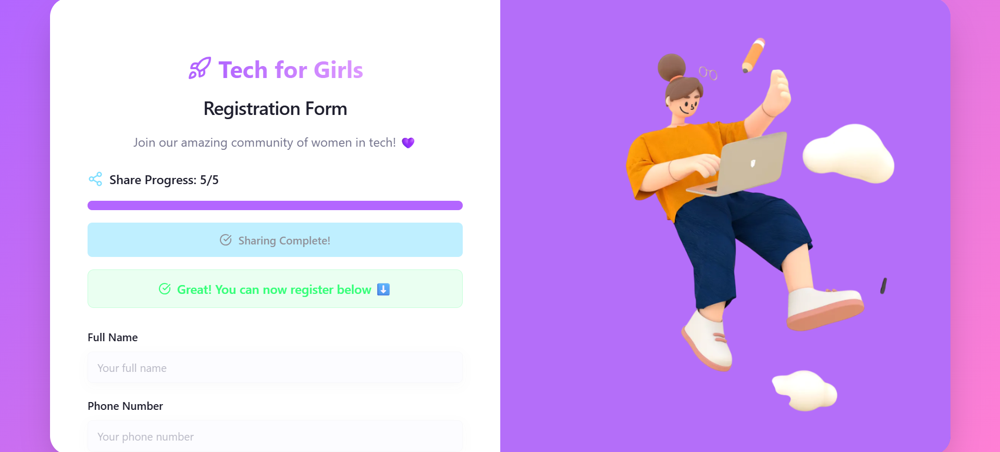

# 🚀 Tech for Girls: Registration Website

A modern, mobile-responsive **registration platform** designed to help girls register for tech events, workshops, or programs with ease. Built with ❤️ using **HTML**, **CSS**, and **JavaScript**, this project includes smart features like WhatsApp sharing, file uploads, Google Sheets integration, and submission protection — all deployed without a backend server!

---



🖥️ **Live Demo**: [Click Here to Try It](https://your-live-site-link)

---

## 🎯 Features

✅ Beautiful and clean UI  
✅ Mobile & desktop responsive  
✅ User-friendly registration form  
✅ Upload screenshot as proof (saved in Google Drive)  
✅ One-time form submission per user using `localStorage`  
✅ Share to WhatsApp with dynamic counter  
✅ Auto-save data in **Google Sheets** via **Google Apps Script**  
✅ Alerts for successful/duplicate submission  
✅ Validations for required fields

---

## 🛠️ Tech Stack

| Tech                      | Usage                              |
| ------------------------- | ---------------------------------- |
| **HTML**                  | Page structure                     |
| **CSS**                   | Styling and responsiveness         |
| **JavaScript**            | Form logic, validations, features  |
| **Google Apps Script**    | Backendless file/data handling     |
| **Google Drive & Sheets** | Stores file uploads & form entries |
| **localStorage**          | Prevent multiple submissions       |

---

## 🧠 How It Works

### 🔗 Form Fields:

- Name
- Phone Number
- Email Address
- College Name
- Screenshot Upload (image file)

### ⚙️ Workflow:

1. User fills the form and uploads a screenshot
2. JavaScript converts the image to **Base64**
3. The form sends data to a **Google Apps Script** endpoint
4. The script saves:
   - Form data to a **Google Sheet**
   - Screenshot to a **Google Drive** folder
5. A one-time submission is enforced using `localStorage`
6. Share button lets users invite others via WhatsApp

---

## 🔐 One-Time Submission Logic

We use:

```js
localStorage.setItem("formSubmitted", "true");
```
